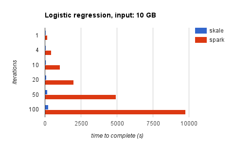

# skale-engine

[](https://gitter.im/skale-me/skale-engine?utm_source=badge&utm_medium=badge&utm_campaign=pr-badge&utm_content=badge)
[](https://travis-ci.org/skale-me/skale-engine)
[](https://ci.appveyor.com/project/skaleme/skale-engine)


High performance distributed data processing engine

Skale-engine is a fast and general purpose distributed data processing
system. It provides a high-level API in Javascript and an optimized
parallel execution engine on top of NodeJS.

The following figure is a [comparison](benchmark/README.md) against [Spark](http://spark.apache.org) for a
logistic regression program:



Word count using skale:

```javascript
var sc = require('skale-engine').context();

sc.textFile('/path/...')
  .flatMap(line => line.split(' '))
  .map(word => [word, 1])
  .reduceByKey((a, b) => a + b, 0)
  .count().then(console.log);
```

## Features

* In-memory computing
* Controlled memory usage, spill to disk when necessary
* Fast multiple distributed streams
* realtime lazy compiling and running of execution graphs
* workers can connect through TCP or websockets
* simple [standalone](#standalone-local-mode) or [fully distributed](#distributed-mode) mode
* very fast, see [benchmark](benchmark/)

## Docs & community

* [Documentation](https://skale-me.github.io/skale-engine)
* [Gitter](https://gitter.im/skale-me/skale-engine) for support and
  discussion
* [skale](https://groups.google.com/forum/#!forum/skale)
  mailing list for discussion about use and development
* [Code of conduct](CODE_OF_CONDUCT.md)
* [Contributing guide](CONTRIBUTING.md)
* [Skale Hacker's Guide](doc/skale-hackers-guide.md)
* [API reference](doc/skale-API.md)
* [Roadmap](Roadmap.md)

## Quickstart

The best and quickest way to get started with skale-engine is to use
[skale](https://www.npmjs.com/package/skale) to create, run
and deploy skale applications.

	$ sudo npm install -g skale  # Install skale command once and for all
	$ skale create my_app        # Create a new app, install skale-engine
	$ cd my_app
	$ skale run                  # Starts a local cluster if necessary and run

## Examples

In the following, we bypass [skale](https://www.npmjs.com/package/skale)
toolbelt, and use directly and only skale-engine. It's for you if you are
rather more interested by the skale-engine architecture, details and internals.

To run the internal examples, clone the skale-engine repository and
install the dependencies:

	$ git clone git://github.com/skale-me/skale-engine.git --depth 1
	$ cd skale-engine
	$ npm install

Then start a skale-engine server and workers on local host:

	$ npm start

Then run whichever example you want

	$ ./examples/wordcount.js /etc/hosts

## Standalone local mode

The standalone mode is the default operating mode. All the processes,
master and workers are running on the local host, using the
[cluster](https://nodejs.org/dist/latest-v7.x/docs/api/cluster.html) core
NodeJS module. This mode is the simplest to operate: no
dependency, and no server nor cluster setup and management required.
It is used as any standard NodeJS package: simply `require('skale-engine')`,
and that's it.

This mode is perfect for development, fast prototyping and tests
on a single machine (i.e. a laptop). For unlimited scalibity, see
distributed mode below.

## Distributed mode

The distributed mode allows to run the exact same code as in standalone over
a network of multiple machines, thus achieving horizontal scalability.

The distributed mode involves two executables, which must
be running prior to launch application programs:

- a `skale-server` process, which is the access point
  where the `master` (user application) and `workers` (running
  slaves) connect to, either by direct TCP connections, or by
  websockets.
- A `skale-worker` process, which is a worker controller, running
  on each machine of the computing cluster, and connecting to
  the `skale-server`. The worker controller will spawn worker
  processes on demand (typically one per CPU), each time a
  new job is submitted.

To run in distributed mode, the environment variable `SKALE_HOST` must
be set to the `skale-server` hostname or IP address. If unset, the
application will run in standalone mode. Multiple applications, each
with its own set of workers and master processes can run simultaneously
using the same server and worker controllers.

Although not mandatory, running an external HTTP server on worker
hosts, exposing skale temporary files, allows efficient peer-to-peer
shuffle data transfer between workers. If not available, this traffic
will go through the centralized `skale-server`. Any external HTTP
server such as nginx, apache or busybox httpd, or even NodeJS
(although not the most efficient for static file serving) will do.

For further details, see command line help for `skale-worker` and `skale-server`.

## Docker

A sample docker image and compose file are provided, to run a minimal
distributed skale stack for experimentation purpose, on a single machine
or on a swarm cluster, as explained [here](docker/README.md).

## Tests

To run the test suite, first install the dependencies, then run `npm test`:

	$ npm install
	$ npm test

## People

The original authors of skale-engine are [Cedric Artigue](https://github.com/CedricArtigue) and [Marc Vertes](https://github.com/mvertes).

[List of all
contributors](https://github.com/skale-me/skale-engine/graphs/contributors)

## License

[Apache-2.0](LICENSE)
