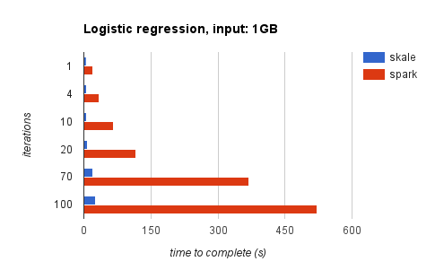

# A first benchmark

In this first benchmark, the goal is to evaluate the performances
of the skale data processing engine.

For that, we use an iterative machine learning application, the
logistic regression.

## Overview

The same algorithm is implemented both in NodeJS/Skale ([skaleLR.js]),
and Python/Spark ([sparkLR.py]). Note that we do not use the spark-ml
library neither the skale-ml library, because our focus here is on
the core engine performances, and we also want this test to remain
standalone and stable accross multiple versions of Skale and Spark.

We use the exact same input file, stored on the local file
system, and run the test using the one same host. We randomly
generated data using [gen_data.js] program.

## Results

Tests are performed an AWS EC2 instance, called m4.4xlarge, with 16 cores and 64 GB RAM.
The spark environment is spark-1.6.1, java-1.8.0_31, Python-3.4.2 (from https://hub.docker.com/r/gettyimages/spark/)
The skale environment is skale-0.4.5, nodejs-4.4.3.

The first set of results is for a 1 GB input file, with 3.829 millions entries of 16 features.

|iterations | skale (sec) | spark (sec) | speedup |
|-----------|-------------|-------------|---------|
|1          | 4.6         | 19.8        | 4.3     |
|4          | 5           | 34.8        | 7.0     |
|10         | 6.5         | 65.9        | 10.1    |
|20         | 8.7         | 116         | 13.3    |
|70         | 20          | 369         | 18.5    |
|100        | 26          | 522         | 20.1    |

The second set of results is for a 10 GB input file, with 38.29 millions entries of 16 features.

|iterations | skale (sec) | spark (sec) | speedup |
|-----------|-------------|-------------|---------|
|1          | 43.9        | 164.9       | 3.8     |
|4          | 48.1        | 455         | 9.5     |
|10         | 58.8        | 1038        | 17.7    |
|20         | 82.2        | 2010        | 24.5    |
|50         | 170         | 4927        | 29      |
|100        | 224         | 9772        | 43.6    |

## Call for contribution

It would be nice to have a spark/scala version of this benchmark which
could possibly perform better than the spark/python version. 

[skaleLR.js]: skaleLR.js
[sparkLR.py]: sparkLR.py
[gen_data.js]: gen_data.js
